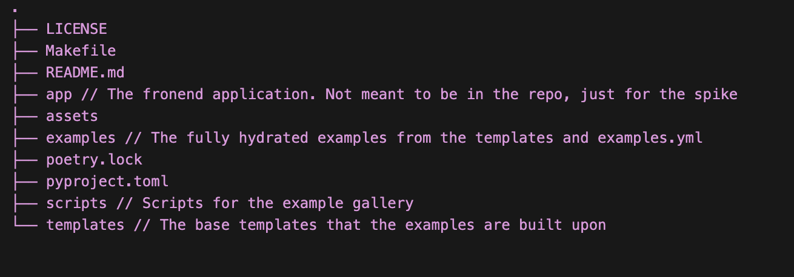
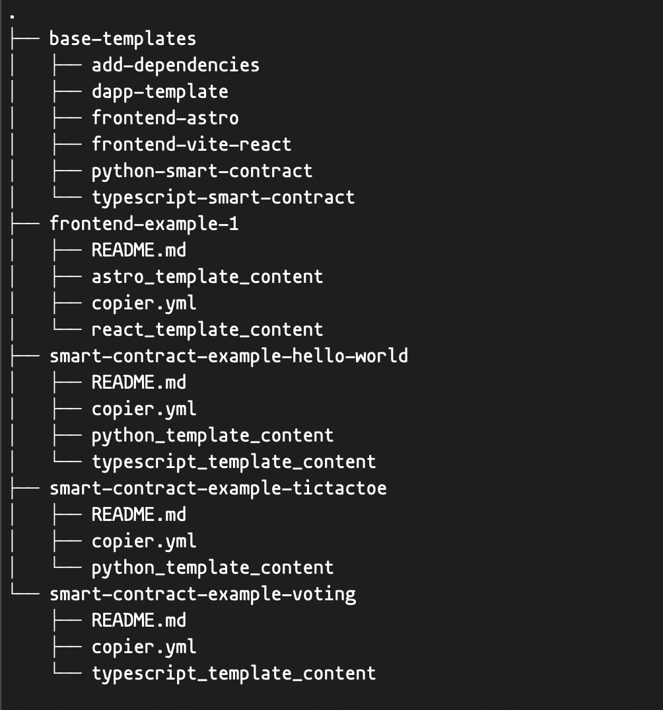

# Example Gallery Spike

---

[Demo App](https://template-gallery-spike.pages.dev/)

## Motivation

The main motivation for this spike is to test the feasibility of a creating an example gallery for the Algorand ecosystem. One of the consistent feedback we have received about AlgoKit is that the hello world example is not enough to get started. It's easy to see how to set up the scaffold, but it's hard to see how to build a real app. Another comment we have received is that the set up to too complex for those wanting to build a simple app or simply exlore.

The example gallery will give the users the ability to see working examples, run them, and/or initialize them in their own environment. There are currently many examples for smart contracts in the individual AlgoKit repositories, but they are not easily discoverable. The gallery provides a visual way for the users to explore the examples and get inspired and use them as a starting point for their own projects.

### Requirements

The following are some of the requirements that guided the spike:

- The examples should be maintainable as the number of examples grows - There is potential to have many examples and manual configurations and testing is not feasible. The easy maintainability of the examples is paramount to having a successful gallery. This means that they should include automatic testing, package management (particularly for the Algorand libs), and configuration management.
- The examples should be composable - The examples should be able to inherit directory structures from other packages. This would allow you to manage a base template such as a basic React App and build a more specific example from it.
- The examples should contain everything needed to run the example - This includes all the dependencies, configuration, and scripts needed to run the example. This will be useful when running the self-contained examples in cloud environments like codesandbox and codespaces.
- The examples should not be manually generated - The examples should be generated using a script. This will allow us to easily generate the examples and keep them up to date.
- The gallery should have a visual web frontend that:
  - Displays the examples in a grid and allows users to filter
  - Displays the metadata for each example including by not limited to: tags, description, features, and initialization commands
  - Creates a detail page for each example that displays the example's README, a live preview if applicable.
- The code for the example gallery should be as consolidated as possible.
  - The templates that generate the examples should be included in the same repository as the gallery.
- The templates and examples should allow for the same template initialization as exists today in AlgoKit. That means that the repo should be connected to the AlgoKit CLI.

# Approach

## Directory Structure



The `base_templates` directory contains the base templates that are used to generate the examples. They will be the templates that exists today but in separate repositories. The examples template are the rest that are not in the `base_templates` directory. They would probably be better grouped into subdirectories but for now this works. Each example folder contains the content for that specific framework. The examples are layer over the base templates.



## Composability and Example Configuration

The example gallery uses a composable architecture where examples are built by layering specialized templates on top of base templates. The examples are then added on top of the base template and specific algorand libs are added to the example. This approach enables code reuse and consistent patterns while maintaining flexibility for specific implementations.

### Base Templates

The foundation of the system lies in the base templates located in `templates/base-templates/`. These templates provide the core structure for different types of projects - frontend applications (Astro, Vite+React), smart contracts (Python, TypeScript), and full dApps that combine both. Each base template is configured through its own `copier.yml` file that defines variables, prompts, and post-generation tasks.

For example, the Python smart contract base template's configuration in `templates/base-templates/python-smart-contract/copier.yaml` is the same copier file that exists today. Nothing would really change from the base templates that exist today. The biggest difference is that they would be consolidated into one repository along with the example templates and the hydrated examples.

### Example Templates

Example templates extend these base templates by adding specific implementations and configurations. The TicTacToe smart contract example in `templates/smart-contract-example-tictactoe/copier.yml` shows how an example builds upon the Python smart contract base. The tictactoe copier file only has the `framework_choice` of python because only the `python_template_content` directory exists. If we wanted to add a typescript smart contract example, we would add a `typescript_template_content` directory and update the copier file with that option. The example.yml would then chose the typescript template as a base template and the `framework_choice` would be typescript.

```yaml
# Template configuration
_templates_suffix: ""
_subdirectory: "python_template_content"

# User prompts
framework_choice:
  type: str
  help: Choose your frontend framework
  choices:
    - python

_tasks:
  - command: |
      # Remove all directories in smart_contracts except:
      # - directories starting with '_'
      # - the 'smart_contracts' directory itself
      # - the 'tictactoe' directory
      find smart_contracts -maxdepth 1 -type d \
        ! -name '_*' \
        ! -name 'smart_contracts' \
        ! -name 'tictactoe' \
        -exec rm -rf {} +
```

The add-dependencies template in `templates/base-templates/add-dependencies/` provides a mechanism for merging dependencies across different templates. You can see from the configuration in `templates/base-templates/add-dependencies/copier.yml` doesn't actually copy any files - notice the \_exclude: ["*"] configuration. Instead, it runs a dependency merging script that combines package dependencies from multiple sources. This is useful for the example templates because they can inherit dependencies from the base templates and the example templates and the final dependencies can be defined from the `add-dependencies` template.

```yaml
# Copier configuration for dependency merging
_tasks:
  - name: Merge dependencies
    command: python ../../scripts/merge_dependencies.py --source "{{ _copier_conf.src_path }}" --destination "{{ _copier_conf.dst_path }}" --overwrite_existing_only false

_exclude:
  - "*" # Exclude all files from being copied

_templates_suffix: "" # No template processing needed

_skip_if_exists:
  - "*" # Skip if any files exist
```

### Configuration Management

The central configuration file `examples.yml` serves as the source of truth for all examples. It defines how templates should be composed and configured. Here's how a dApp example is configured:

```yaml
templates:
  - source: "templates/base-templates/dapp-template"
    data:
      project_name: "dApp-basic"
      author_name: ""
      contract_name: "counter"
      preset_name: "starter"
      deployment_language: "python"
      use_workspace: true
  - source: "templates/base-templates/python-smart-contract"
    destination: "examples/dapp-basic/projects/dApp-basic-contracts"
    data:
      project_name: "Python Smart Contract Example"
      contract_name: "hello_world"
  - source: "templates/base-templates/frontend-vite-react"
    destination: "examples/dapp-basic/projects/dApp-basic-frontend"
    data:
      project_name: "Counter Frontend"
      description: "React frontend for the counter smart contract"
```

The example generation process is handled by `scripts/create_examples.py`, which reads this configuration and processes each template in sequence. The script ensures proper template composition and dependency management.

To maintain consistency and completeness, example configurations are validated using the schema defined in `scripts/validate_configuration.py`

```python
class Example(BaseModel):
    id: str = Field(
        description="Unique identifier for the example."
    )
    type: ExampleType = Field(
        description="Category of the example (frontend, smart-contract, or dapp)"
    )
    author: str = Field(
        description="Name or organization of the example's author"
    )
```

This architecture makes it straightforward to add new examples by defining their composition in examples.yml and creating any example-specific template content, while leveraging existing base templates for common functionality.

## Testing

Testing follows the same composable architecture as the examples themselves. Just as base templates provide foundational structure, they also establish core testing patterns that example templates can extend and customize.
Base templates include standard testing configurations - for instance, the Python smart contract template includes pytest setup for both unit tests and application client tests. From templates/base-templates/python-smart-contract/copier.yaml:

```yaml
use_python_pytest:
  type: bool
  when: "{{ preset_name == 'custom' }}"
  help: Do you want to include unit tests (via pytest)?
  default: "{{ 'yes' if preset_name == 'production' else 'no' }}"
```

When an example template extends a base template, it inherits these testing configurations and can add its own specific test cases. For instance, the TicTacToe example adds game-specific test scenarios while utilizing the testing framework provided by the Python smart contract base template.
The testing configuration is also managed through the central examples.yml, ensuring that test dependencies and configurations are properly merged across templates. This means that when generating an example, the appropriate testing framework and configuration are automatically included based on the template composition.

## Managing Dependencies

Dependencies in the template gallery follow a hierarchical inheritance pattern, where each layer can build upon or override the previous ones. This approach allows for flexible

When an example is generated, the dependency resolution process:

1. Starts with the base template's dependencies
2. Applies any additions or overrides from the example template
3. Optionally processes the add-dependencies template to merge and resolve any conflicts

The process is managed through the examples.yml configuration, which specifies the template composition and therefore the dependency inheritance chain for each example.

### Inheritance Flow

1. The dependency inheritance flows through three levels:
   Base templates provide foundational dependencies. For instance, a React base template includes core React dependencies, while a Python smart contract template includes basic Algorand SDK dependencies.

2. Example templates can then extend or override these base dependencies to add specific packages needed for their implementation. For example, a TicTacToe smart contract might add state management libraries on top of the base Python smart contract dependencies.

3. Finally, the add-dependencies template in templates/base-templates/add-dependencies/ provides an optional final layer of dependency management:

```yaml
# Copier configuration for dependency merging
_tasks:
  - name: Merge dependencies
    command: python ../../scripts/merge_dependencies.py --source "{{ _copier_conf.src_path }}" --destination "{{ _copier_conf.dst_path }}" --overwrite_existing_only false

_exclude:
  - "*" # Exclude all files from being copied

_templates_suffix: "" # No template processing needed

_skip_if_exists:
  - "*" # Skip if any files exist
```

This template is unique as it doesn't copy files (\_exclude: ["*"]) but instead runs a merge script to combine dependencies from multiple sources. The script handles version conflicts and ensures compatibility between different dependency sets.

## Deployment

The template gallery uses GitHub Actions for automated deployment and example management through three key workflows that are triggered by different events. These workflows work together to maintain a live demo site, provide easy access to individual examples, and ensure example quality through automated testing. The deployment process is entirely automated, triggered by pull_requests, pushes to the main branch or manual workflow dispatch.

### On Pull Request Trigger

The run-test.yml workflow ensures example quality by running tests across all examples. The workflow detects project types (Node.js, Python, or dApp) and runs appropriate tests, ensuring all examples remain functional as the gallery evolves.

```yaml
jobs:
  test-examples:
    runs-on: ubuntu-latest
    steps:
      - name: Run tests for each example
        run: |
          # Process each example
          echo "$EXAMPLES" | yq e -o=json -I=0 '.' - | jq -r '.[] | @json' | while read -r example; do
            ID=$(echo "$example" | jq e '.id' -)
            TYPE=$(echo "$example" | yq e '.type' -)
            # ... test execution steps ...
          done
```

### On Push to Main Trigger

#### Example Branch Creation

The workflow creates a new branch for each example and updates the branch with the latest changes from the main branch. These branches only contain the fully hydrated example files that can copied and run into their own environment. These are primarily used to launch Github codespaces for the examples.

```yaml
name: Create Example Branches

permissions:
  contents: write

jobs:
  create-branches:
    runs-on: ubuntu-latest
    steps:
      - name: Create branches for examples
        run: |
          # Get list of example directories
          for dir in examples/*/; do
            dir_name=${dir#examples/}
            branch_name="examples/$dir_name"
            # ... branch creation and update steps ...
          done
```

#### Publishing the Demo Sites

Only the examples that are frontend only have the ability to create demo sites. One important caveat of that is that they will have to point to existing network in order for them to work. Since the frontend examples are static sites, they can be hosted on Github Pages. The frontend demo sites are automatically deployed through the `publish-demo-sites.yml` workflow. The workflow reads the examples.yml configuration, identifies frontend examples, and builds each one with the appropriate base path for GitHub Pages deployment.

```yaml
name: Publish Demo Sites

permissions:
  contents: read
  pages: write
  id-token: write

jobs:
  build-and-deploy:
    runs-on: ubuntu-latest
    steps:
      - name: Parse examples and build frontends
        run: |
          # Read examples.yml and filter frontend examples
          FRONTEND_EXAMPLES=$(yq e '.examples | map(select(.type == "frontend"))' examples/examples.yml)

          # Process each frontend example as a complete object
          echo "$FRONTEND_EXAMPLES" | yq e -o=json -I=0 '.' - | jq -r '.[] | @json' | while read -r example; do
            ID=$(echo "$example" | jq -r '.id')
            REPO_PATH=examples/$ID
            # ... build steps ...
          done
```

## Developing the Templates and Examples

Unfortunately, similar to how it is today, the developer would develop in the fully hydrated examples folder and port the changes back to the templates. There are probably ways to make this better, but we can figure that out as we go.

## Linking to the AlgoKit CLI

DEMO


[AlgoKit CLI Repo Spike Branch](https://github.com/algorandfoundation/algokit-cli/tree/feature/example-gallery-spike)

Currently the cli init command runs copier on the templates repo URL. Given that the templates are now in the same repo as the examples, I switched the init command to build the templates yaml similar to the examples.yml file based on the prompts in the menus. I switched the CLI to use [python textual](https://textual.textualize.io/) which gives a richer experience for the CLI.
